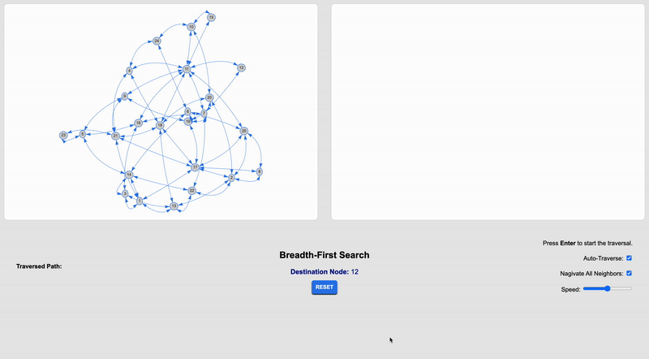
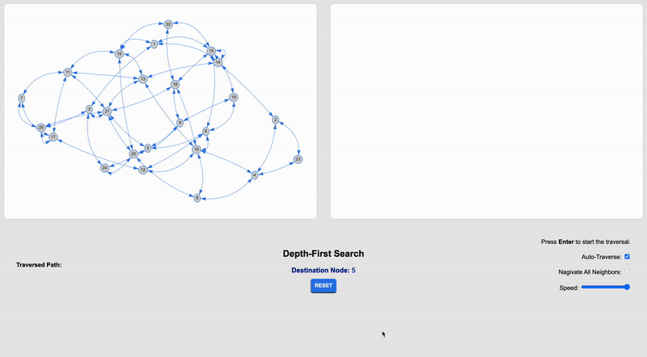

# Depth and Breadth First Search Visualization
---

## Table of Contents
1. [Overview](#overview)
2. [Features](#features)
3. [Technologies Used](#technologies-used)
4. [Installation](#installation)
5. [Usage](#usage)
6. [Visuals](#visuals)
7. [Future Enhancements](#future-enhancements)
8. [Contributing](#contributing)

---

## Overview
- **What**: This Project's goal is to visualize the node-traversing of the Depth and Breadth first search algorithm on a step-by-step controlled basis
- **Why**: It exists to try to explain a non-to-easy to understand topic in a easier way to understand.
- **How**: The program uses vis.js to visualize the nodes and uses a step-by-step version of the both algorithms to show incremental results.

---

## Features
- Real-time DFS visualization.
- Highlighted nodes and edges during traversal.
- Support for exploring large graphs.
- Control over Speed of Traversal
- Customization <b>OTW</b>
---

## Technologies Used
- **Languages**: JavaScript, HTML, CSS
- **Libraries**: [vis.js](https://github.com/visjs)

---

## Installation
1. Clone the repository:
   ```bash
   git clone https://github.com/your-username/your-repo-name.git
   ```
2. Navigate to the project directory
    ```bash
    cd your-repo-name
    ```
3. Open ```depthVisualization.html``` or ```breadthVisualization.html``` in your browser

## Usage 
1. Generate a graph of random nodes and edges between them
2. Chose between using depth or breadth first search depending on the file you open
3. Adjust visualization settings like speed, auto-traversal, and navigating more than one node per step


## Visuals
<table>
    <tr>
        <td>


        </td>
        <td>


        </td>
    </tr>
</table>

## Future Enhancements
- Combine the HTML files into one
- Allow for the creation of graphs without needing to code.
- Add ability to chose starting and ending nodes

## Contributing
1. Fork the repository
2. Create a feature branch
```bash
git checkout -b feature-name
```
3. Commit changes and submit a pull request

